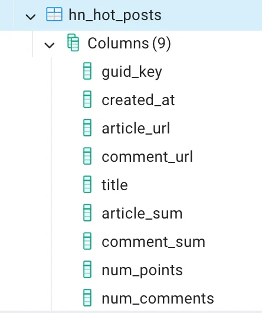
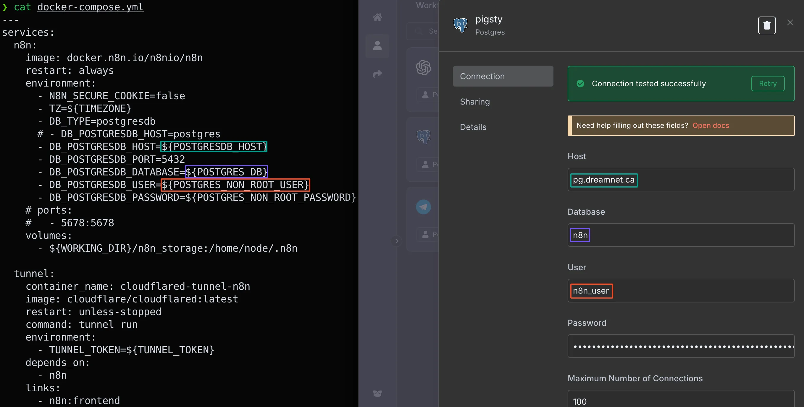

Connect to the database.

```bash
psql postgres://n8n_user:N8N_USER_PASSWORD@DB_FQDN_OR_IP_ADDRESS/n8n
```

Create a table `hn_hot_posts` in `public` Schema.

```sql
CREATE TABLE public.hn_hot_posts (
    guid_key BIGINT PRIMARY KEY,
    created_at TIMESTAMP NOT NULL DEFAULT NOW(),
    article_url VARCHAR(2048),
    comment_url VARCHAR(2048),
    title TEXT,
    article_sum TEXT,
    comment_sum TEXT,
    num_points integer,
    num_comments integer
);
```

 

 

Query to check if a `guid_key` exists:

``` sql
SELECT EXISTS (
    SELECT 1 FROM public.hn_hot_posts WHERE guid_key = {{ $json.guid_key }}
);
```

Delete posted articles older than 14 days:
```sql
DELETE FROM public.hn_hot_posts
WHERE created_at < NOW() - INTERVAL '14 days';
```


